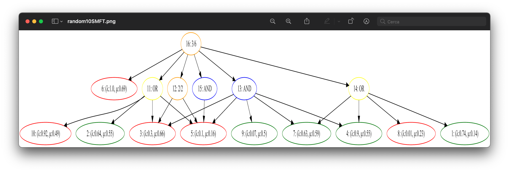

# Stochastic Markovian Fault Trees Analyzer
Un package che permette di creare degli SMFT e di valutarne le principali caratteristiche, ossia i suoii intervalli di confidenza e la sua ergodicità.

## Uso
### Costruzione albero
La costruzione dell'albero avviene in modo bottom-up: si parte dalle foglie, e con esse si definiscono gli altri nodi, arrivando eventualmente al top event.
I singoli elementi possono essere creati per mezzo della classe EventFactory, che può creare (anche in modo casuale) sia i Basic Event che gli Intermediate Event.

#### Nota:
Attualmente i nodi intermedi disponibili sono i gate statici AND, OR, KN, ed il gate dinamico SequentialAND

Una volta definiti i tutti i nodi bisogna incapsulare l'albero con la classe TreeManager, che deve conoscerne il top e le foglie.

### Calcolo dati
Il calcolo dei dati è gestito dalle classi Analyzer e Simulator: una volta impostato il Simulator possiamo, tramite Analyzer, impostare il numero di simulazioni da eseguire e calcolare gli intervalli di confidenza e stimare l'ergodicità del sistema. 
A questo punto è possibile usare la classe HarryPlotter per stampare i risultati desiderati.

