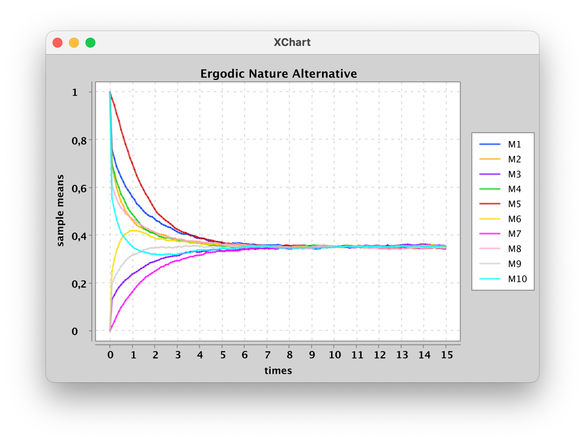

# Fault Tree Analyzer (FTA) 🌳

A comprehensive package for modeling SMFTs (Stochastic Markovian Fault Trees), either manually or randomly, evaluating their main characteristics, defining confidence intervals for the expected value of the operational state, and assessing their ergodic nature.

## Usage 🚀

### Modeling the SMFT 
#### Manual Mode ✍️
Build the tree using a bottom-up approach: start from the leaves, then define the other nodes using them, until reaching the top event.

#### Random Mode 🎲
After specifying the desired number of leaves, the model will be generated randomly with 3 levels of depth.

---

### Data Calculation 📊
Data calculation is managed by the `Analyzer` and `Simulator` classes. Once the `Simulator` is set up, you can use the `Analyzer` to specify the number of simulation runs, define confidence intervals, and evaluate the ergodic nature of the system. You can then use the `HarryPlotter` class to visualize the desired results.

#### Confidence Interval 📉

#### Ergodicity 🔄
Two graphs are proposed:
- **Behavior of the sample mean and variance**: If both are stable, the system is ergodic.
- **Trend of the means**: If the means tend to a common value, the system is ergodic.

---

### Notes 🌟
- Currently, the available intermediate nodes are the static gates AND, OR, KN, and the dynamic gate SequentialAND.
- Once all nodes are defined, the tree must be encapsulated with the `TreeManager` class, which must know the top event and the leaves.
- The graphs allow for zooming in for detailed analysis.

---

This README provides a concise overview of the Fault Tree Analyzer (FTA) package, detailing the steps to model trees manually or randomly, and explaining how to analyze and visualize the results, including confidence intervals and ergodicity. Enjoy your journey into fault tree analysis! 🚀
