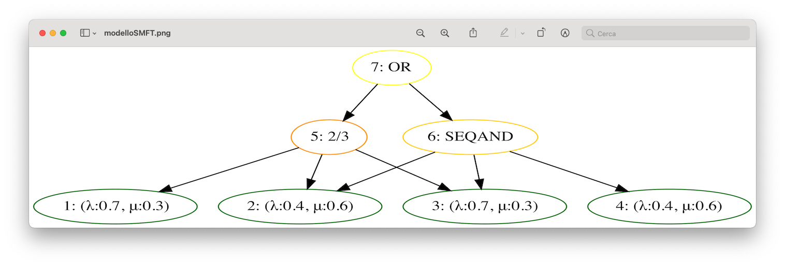
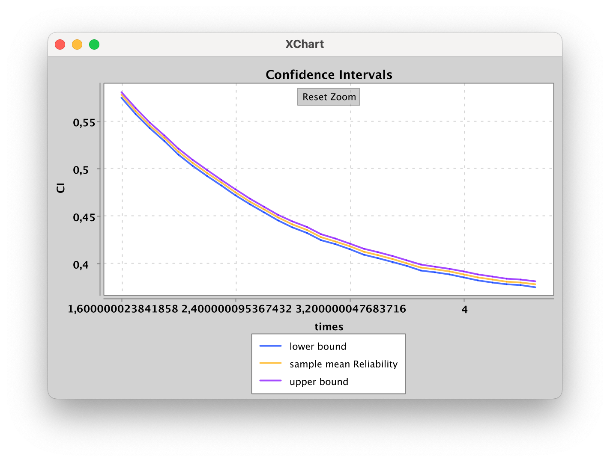

# Stochastic Markovian Fault Trees Analyzer
Un package che permette modellare degli SMFT, manualmente oppure in modo randomico, e di valutarne le principali caratteristiche,  definire intervalli di confidenza per il valore atteso dello stato di funzionamento e valutarne la natura ergodica.

## Uso
### Modellazione dello SMFT 
#### Modalità Manuale
La costruzione dell'albero avviene in modo bottom-up: si parte dalle foglie, e con esse si definiscono gli altri nodi, fino ad arrivare al top event.

#### Modalità Randomica
Definito un numero desiderato di foglie, il modello verrà generato in modo casuale su 3 livelli di profondità. 

### Calcolo dati
Il calcolo dei dati è gestito dalle classi Analyzer e Simulator: una volta impostato il Simulator possiamo, tramite Analyzer, impostare il numero di simulazioni (runs) da eseguire e definire gli intervalli di confidenza e valutare la natura ergodica del sistema. 
A questo punto è possibile usare la classe HarryPlotter per stampare i risultati desiderati.

#### Intervallo di confidenza

#### Ergodicità
Vengono proposti due grafici:
- Andamento della media e della varianza campionaria. Se entrambi sono stabili si ha ergodicità
- Trend delle medie. Se le medie tendono ad un medesimo volarore allora si ha l'ergodicità

#### Nota bene:
- Attualmente i nodi intermedi disponibili sono i gate statici AND, OR, KN, ed il gate dinamico SequentialAND
- Una volta definiti i tutti i nodi bisogna incapsulare l'albero con la classe TreeManager, che deve conoscerne il top e le foglie.
- Sui grafici è possibile effettuare lo zoom
